# Remote Connection Monitor - Technical Architecture Document

## 1. Architecture Design


## 2. Technology Description

* Frontend: React\@18 + TypeScript + Tailwind CSS + Vite + Socket.io-client

* Backend: Node.js\@18 + Express\@4 + Socket.io + Mongoose + bcrypt + jsonwebtoken

* Database: MongoDB\@6 (local or MongoDB Atlas)

* Monitoring Service: Python\@3.11 + psutil + pywin32 + scapy + asyncio

* System Integration: Windows APIs, PowerShell, netstat, WMI

## 3. Route Definitions

| Route           | Purpose                                                                          |
| --------------- | -------------------------------------------------------------------------------- |
| /               | Dashboard page, displays real-time connection overview and security alerts       |
| /history        | Connection history page, shows historical connection logs with search and filter |
| /settings       | Security settings page, manages blocking rules and alert configurations          |
| /connection/:id | Connection details page, provides detailed analysis and removal instructions     |
| /monitor        | System monitor page, displays service status and resource usage                  |
| /login          | Authentication page for user login and role-based access                         |

## 4. API Definitions

### 4.1 Core API

**Authentication**

```
POST /api/auth/login
```

Request:

| Param Name | Param Type | isRequired | Description                       |
| ---------- | ---------- | ---------- | --------------------------------- |
| username   | string     | true       | Windows username or admin account |
| password   | string     | true       | User password (hashed on client)  |

Response:

| Param Name | Param Type | Description                      |
| ---------- | ---------- | -------------------------------- |
| success    | boolean    | Authentication status            |
| token      | string     | JWT token for session management |
| role       | string     | User role (admin/user)           |

**Real-time Connections**

```
GET /api/connections/active
```

Response:

| Param Name  | Param Type | Description                        |
| ----------- | ---------- | ---------------------------------- |
| connections | array      | List of active remote connections  |
| count       | number     | Total number of active connections |
| lastUpdated | string     | Timestamp of last update           |

**Connection History**

```
GET /api/connections/history
```

Request:

| Param Name | Param Type | isRequired | Description                    |
| ---------- | ---------- | ---------- | ------------------------------ |
| page       | number     | false      | Page number for pagination     |
| limit      | number     | false      | Number of records per page     |
| startDate  | string     | false      | Filter start date (ISO format) |
| endDate    | string     | false      | Filter end date (ISO format)   |
| ipAddress  | string     | false      | Filter by IP address           |

**Connection Control**

```
POST /api/connections/:id/terminate
```

Request:

| Param Name | Param Type | isRequired | Description            |
| ---------- | ---------- | ---------- | ---------------------- |
| force      | boolean    | false      | Force termination flag |
| reason     | string     | false      | Reason for termination |

**Security Settings**

```
POST /api/settings/blocking-rules
```

Request:

| Param Name | Param Type | isRequired | Description                       |
| ---------- | ---------- | ---------- | --------------------------------- |
| ipAddress  | string     | true       | IP address or CIDR block to block |
| port       | number     | false      | Specific port to block            |
| protocol   | string     | false      | Protocol type (TCP/UDP)           |
| enabled    | boolean    | true       | Rule activation status            |

## 5. Server Architecture Diagram


## 6. Data Model

### 6.1 Data Model Definition

```mermaid
erDiagram
    USER ||--o{ CONNECTION_LOG : monitors
    CONNECTION_LOG ||--o{ CONNECTION_DETAIL : contains
    USER ||--o{ BLOCKING_RULE : creates
    USER ||--o{ ALERT_CONFIG : configures
    CONNECTION_LOG ||--o{ SECURITY_ALERT : triggers

    USER {
        string id PK
        string username
        string passwordHash
        string role
        datetime createdAt
        datetime lastLogin
    }
    
    CONNECTION_LOG {
        string id PK
        string userId FK
        string remoteIP
        int remotePort
        string localPort
        string protocol
        string connectionType
        string processName
        int processId
        string username
        datetime startTime
        datetime endTime
        string status
        boolean isBlocked
    }
    
    CONNECTION_DETAIL {
        string id PK
        string connectionId FK
        string authMethod
        string userAgent
        string geoLocation
        string riskLevel
        json metadata
        datetime createdAt
    }
    
    BLOCKING_RULE {
        string id PK
        string userId FK
        string ipAddress
        int port
        string protocol
        string ruleType
        boolean enabled
        datetime createdAt
        datetime updatedAt
    }
    
    ALERT_CONFIG {
        string id PK
        string userId FK
        string alertType
        boolean emailEnabled
        boolean desktopEnabled
        json thresholds
        datetime createdAt
    }
    
    SECURITY_ALERT {
        string id PK
        string connectionId FK
        string alertType
        string severity
        string message
        boolean acknowledged
        datetime createdAt
    }
```



### 6.2 Data Definition Language

**Users Collection**

```javascript
// MongoDB Schema
const userSchema = {
  _id: ObjectId,
  username: String, // required, unique
  passwordHash: String, // required
  role: String, // enum: ['admin', 'user'], default: 'user'
  createdAt: Date, // default: now
  lastLogin: Date
};

// Index
db.users.createIndex({ "username": 1 }, { unique: true });
```

**Connection Logs Collection**

```javascript
const connectionLogSchema = {
  _id: ObjectId,
  userId: ObjectId, // reference to users
  remoteIP: String, // required
  remotePort: Number, // required
  localPort: String, // required
  protocol: String, // enum: ['TCP', 'UDP']
  connectionType: String, // enum: ['RDP', 'SSH', 'VNC', 'TeamViewer', 'Other']
  processName: String,
  processId: Number,
  username: String, // remote user
  startTime: Date, // required, default: now
  endTime: Date,
  status: String, // enum: ['active', 'closed', 'blocked']
  isBlocked: Boolean, // default: false
  createdAt: Date // default: now
};

// Indexes
db.connectionLogs.createIndex({ "userId": 1, "startTime": -1 });
db.connectionLogs.createIndex({ "remoteIP": 1 });
db.connectionLogs.createIndex({ "status": 1 });
db.connectionLogs.createIndex({ "createdAt": -1 });
```

**Blocking Rules Collection**

```javascript
const blockingRuleSchema = {
  _id: ObjectId,
  userId: ObjectId, // reference to users
  ipAddress: String, // required, can be CIDR notation
  port: Number, // optional
  protocol: String, // enum: ['TCP', 'UDP', 'ALL']
  ruleType: String, // enum: ['IP_BLOCK', 'PORT_BLOCK', 'GEO_BLOCK']
  enabled: Boolean, // default: true
  createdAt: Date, // default: now
  updatedAt: Date // default: now
};

// Index
db.blockingRules.createIndex({ "userId": 1, "enabled": 1 });
```

**Security Alerts Collection**

```javascript
const securityAlertSchema = {
  _id: ObjectId,
  connectionId: ObjectId, // reference to connectionLogs
  alertType: String, // enum: ['SUSPICIOUS_IP', 'MULTIPLE_ATTEMPTS', 'UNAUTHORIZED_ACCESS']
  severity: String, // enum: ['LOW', 'MEDIUM', 'HIGH', 'CRITICAL']
  message: String, // required
  acknowledged: Boolean, // default: false
  createdAt: Date // default: now
};

// Index
db.securityAlerts.createIndex({ "createdAt": -1 });
db.securityAlerts.createIndex({ "severity": 1, "acknowledged": 1 });
```

**Initial Data**

```javascript
// Create default admin user
db.users.insertOne({
  username: "admin",
  passwordHash: "$2b$10$...", // bcrypt hash of default password
  role: "admin",
  createdAt: new Date()
});

// Create default alert configurations
db.alertConfigs.insertMany([
  {
    userId: ObjectId("admin_user_id"),
    alertType: "SUSPICIOUS_CONNECTION",
    emailEnabled: true,
    desktopEnabled: true,
    thresholds: { maxConnections: 5, timeWindow: 300 },
    createdAt: new Date()
  }
]);
```

