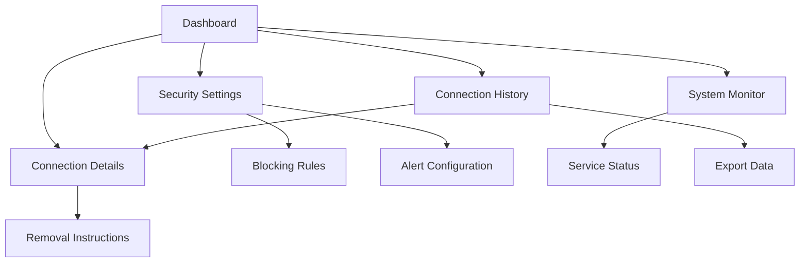

# Remote Connection Monitor - Product Requirements Document

## 1. Product Overview
A comprehensive security application that monitors, detects, and manages all remote connections to Windows 11 computers in real-time.
- Provides system administrators and security-conscious users with complete visibility into remote access activities, enabling proactive security management and threat detection.
- Targets individual users, small businesses, and IT departments who need to maintain strict control over remote access to their Windows systems.

## 2. Core Features

### 2.1 User Roles
| Role | Registration Method | Core Permissions |
|------|---------------------|------------------|
| Administrator | Local system login with admin privileges | Full access to all monitoring features, connection blocking, system configuration |
| Standard User | Local system login | View-only access to connection history and basic monitoring data |

### 2.2 Feature Module
Our remote connection monitoring application consists of the following main pages:
1. **Dashboard**: Real-time connection overview, active connections display, security alerts panel, system status indicators.
2. **Connection History**: Historical connection logs, detailed connection information, search and filter capabilities, export functionality.
3. **Security Settings**: Connection blocking rules, alert configurations, monitoring preferences, automated response settings.
4. **Connection Details**: Individual connection analysis, threat assessment, removal instructions, connection metadata.
5. **System Monitor**: Resource usage tracking, service status monitoring, network interface statistics.

### 2.3 Page Details
| Page Name | Module Name | Feature description |
|-----------|-------------|---------------------|
| Dashboard | Real-time Monitor | Display active remote connections with IP addresses, ports, protocols, and connection duration |
| Dashboard | Security Alerts | Show security warnings for suspicious connections, unauthorized access attempts, and policy violations |
| Dashboard | Quick Actions | Provide one-click connection termination, emergency lockdown, and alert acknowledgment |
| Connection History | Connection Log | Maintain comprehensive history of all remote connections with timestamps, user details, and session information |
| Connection History | Search & Filter | Enable filtering by date range, IP address, connection type, user, and security status |
| Connection History | Export Data | Generate reports in CSV, PDF formats for security auditing and compliance |
| Security Settings | Blocking Rules | Configure IP blacklists, port restrictions, protocol filtering, and geographic blocking |
| Security Settings | Alert Configuration | Set up email notifications, desktop alerts, and automated response triggers |
| Security Settings | Monitoring Preferences | Customize monitoring intervals, log retention periods, and detection sensitivity |
| Connection Details | Connection Analysis | Display detailed connection metadata including process information, authentication method, and risk assessment |
| Connection Details | Removal Instructions | Provide step-by-step guides for terminating connections and preventing reconnection |
| Connection Details | Threat Assessment | Analyze connection patterns, identify potential security risks, and suggest mitigation actions |
| System Monitor | Service Status | Monitor Windows remote services (RDP, WinRM, SSH), third-party remote tools, and network listeners |
| System Monitor | Resource Usage | Track CPU, memory, and network usage related to remote connections |
| System Monitor | Network Statistics | Display network interface statistics, bandwidth usage, and connection patterns |

## 3. Core Process

**Administrator Flow:**
Administrators access the dashboard to view real-time remote connections, configure security settings, and manage blocking rules. They can drill down into connection details for threat analysis, execute immediate connection termination, and review historical data for security auditing.

**Standard User Flow:**
Standard users can view the dashboard for awareness of current remote connections, browse connection history for their sessions, and receive security alerts about their system's remote access activity.

**System Monitoring Flow:**
The system continuously monitors network connections, Windows services, and third-party remote access tools. When suspicious activity is detected, alerts are generated and appropriate automated responses are triggered based on configured rules.

## 4. User Interface Design

### 4.1 Design Style
- Primary colors: Dark blue (#1e3a8a) for headers and navigation, red (#dc2626) for alerts and critical actions
- Secondary colors: Light gray (#f3f4f6) for backgrounds, green (#16a34a) for safe/normal status indicators
- Button style: Rounded corners with subtle shadows, flat design with hover effects
- Font: Segoe UI for Windows consistency, 14px base size for readability
- Layout style: Card-based design with clean spacing, top navigation with sidebar for main sections
- Icons: Feather icons for consistency, security-themed icons for alerts and status indicators

### 4.2 Page Design Overview
| Page Name | Module Name | UI Elements |
|-----------|-------------|-------------|
| Dashboard | Real-time Monitor | Grid layout with connection cards, color-coded status indicators, live updating counters |
| Dashboard | Security Alerts | Alert banner with severity levels, expandable alert details, dismiss/acknowledge buttons |
| Dashboard | Quick Actions | Prominent action buttons with confirmation dialogs, emergency stop button with red styling |
| Connection History | Connection Log | Data table with sortable columns, pagination controls, row selection for bulk actions |
| Connection History | Search & Filter | Filter sidebar with date pickers, dropdown selectors, search input with autocomplete |
| Security Settings | Blocking Rules | Form inputs with validation, toggle switches for enable/disable, rule priority ordering |
| Security Settings | Alert Configuration | Notification preference checkboxes, email input fields, threshold sliders |
| Connection Details | Connection Analysis | Information panels with icons, progress bars for risk assessment, expandable sections |
| Connection Details | Removal Instructions | Step-by-step wizard interface, code blocks for commands, copy-to-clipboard buttons |
| System Monitor | Service Status | Status cards with green/red indicators, service control buttons, refresh timestamps |

### 4.3 Responsiveness
The application is desktop-first with responsive design for tablet viewing. Touch interaction optimization is included for touch-enabled Windows devices, with larger buttons and touch-friendly spacing for critical security actions.